# Lord of the Recipes

[Live Site]( )

1. [Introduction](#introduction)
2. [Data Structure](#data-structure)
3. [Technologies used](#technologies-used)
4. [Features](#features)
5. [Testing](#testing)
6. [Bugs](#bugs)
7. [Credits](#credits)
8. [Deployment](#deployment)
9. [Acknowledgements](#acknowledgements)

## Introduction

***

Welcome to **Lord of the Recipes**. This website has been built for my fourth portfolio project with the Code Institute to create a django based application. This site is a hosting platform for recipes with a pop culture theme. So the target audience is anyone with a passion for cooking or baking (or y'know, just food in general) and a love for pop culture of any flavour. The recipes are open to be viewed by anyone who stumbles across the site. To add their own recipes, save their favourites or leave comments on other recipes, users must register an account.  
Unfortunately the internet can be a dangerous place these days, so to protect users from trolls and other creatures which lurk in the dark recesses of the web any content uploaded will be submitted to admin for approval before being published. 

### Project Planning

#### Agile Development

Agile development helps to create an organised and efficient development plan to create a project which fulfills it's purpose. I have attempted to use this approach to build this project.  
This system requires a thorough project planning phase - deciding what the app is, and what the main goals of the project are. These are then developed into user stories, and features are built to address these user stories. To keep track of my development I created a user stories kanban board in github projects ([here](https://github.com/hartnetl/lord-of-the-recipes/projects/1)). I created an issue for each user story which was set to automatically display in my user story project. As I tackled each user story, it was moved to the in progress column. When I felt it had been completed it was moved to complete. Agile development also allows for the project to change. If the requirements have been met it is possible to revisit an issue to make changes or improvements to deliver the project in the best form possible.  
A second kanban board was created on github projects - a [todo list](https://github.com/hartnetl/lord-of-the-recipes/projects/2). This list contained small detail or general things that were needed but weren't attributable to a user story.

#### User stories 

| As a:       | I can:         | So that:  |
| ------------- |:-------------:| -----:|
| general user  | click on the navbar links | I can easily and intuitively go from one page to another |
| general user  | use the contact page form |  I can communicate with the admin of the page with questions, comments, user feedback etc |
| general user  | click recipes | I can view them fully on a new page |
| general user  | search recipes by tags | I can easily find what I'm looking for |
| general user  | view a list of recipes | I can choose which one to make |
| general user  | create an account | I can join the community and get access to registered user features like creating recipes and adding comments |
|  |     |  |
| Registered User |  upload recipes  |  recipes can be viewed by myself and others when complete, or saved as a draft for myself until ready to be published |
| Registered User |  create, edit and delete my recipes | I can control my own contributions to the site |
| Registered User | add comments on recipes  | I can be a part of the conversation with the community |
|  |       |   |
| Superuser | approve content (recipes and comments) | I can manage the content and filter out those with unsuitable language etc |  
| |     |  |

#### Wireframes

Show wireframes

Home Page - logged in view

A logged in registered user sees a logout and profile button in the navbar and footer instead of login and register. Clicking the burger button causes the navbar to expand/collapse. This is common across all pages. The signup box on the home page is removed.  
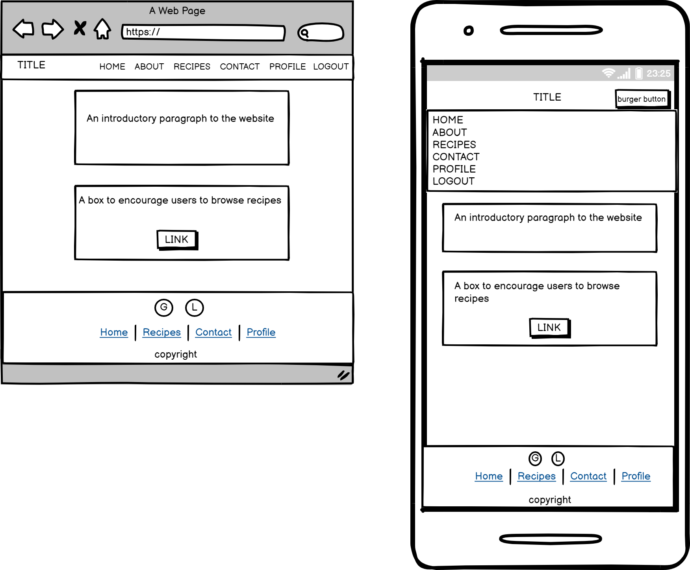

 

Home Page - logged out view

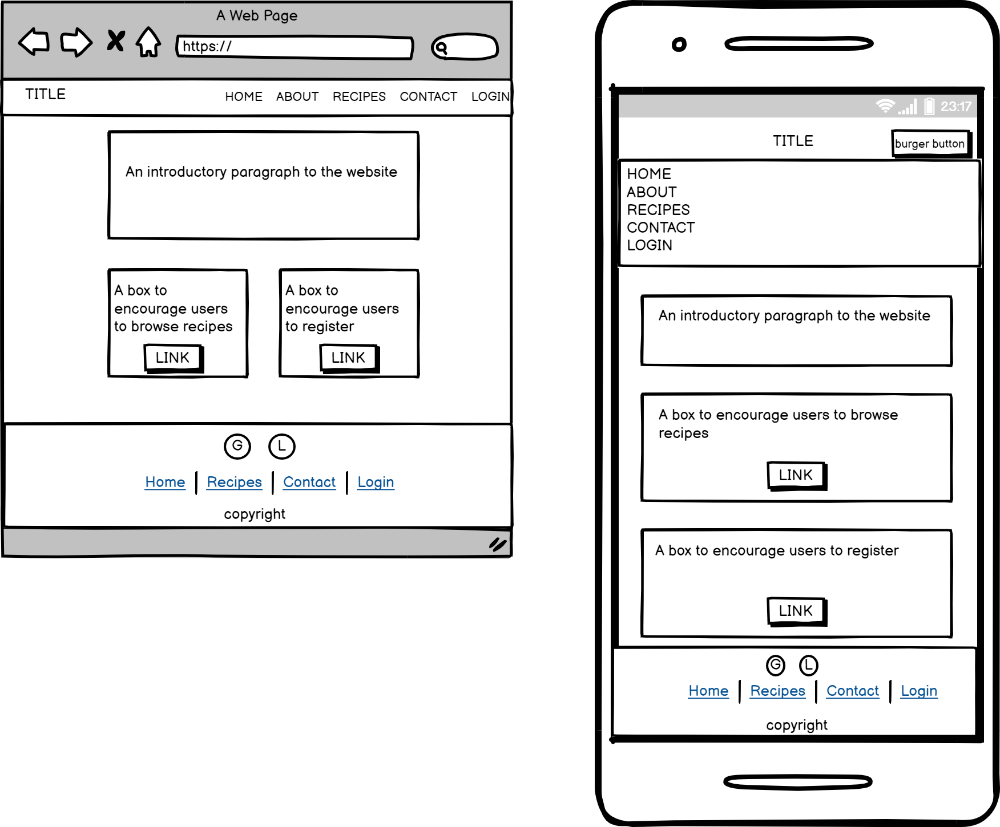

 

About Page

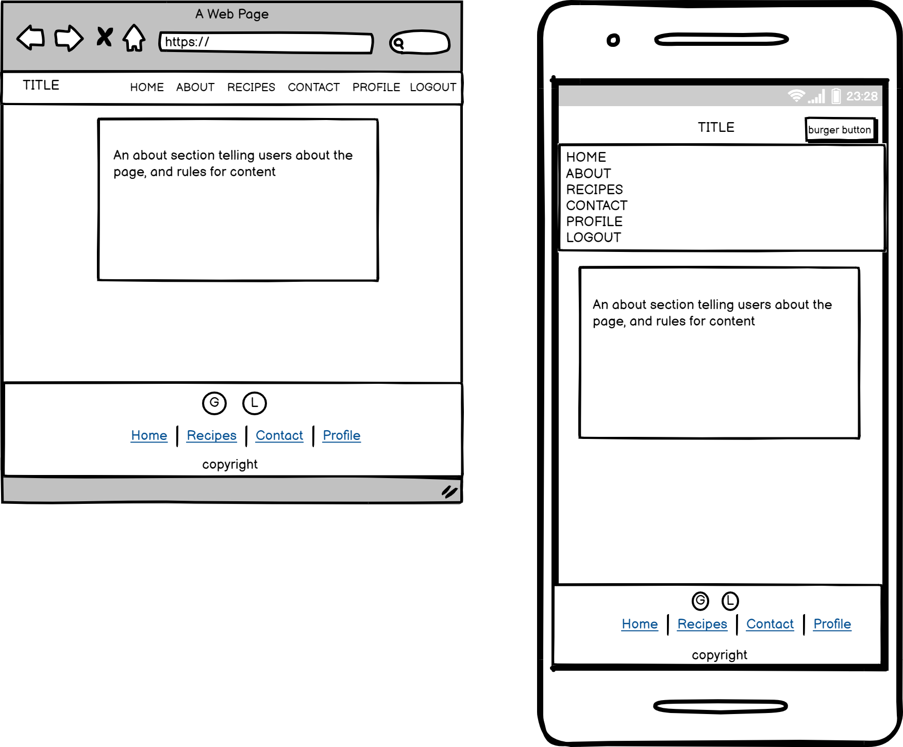

 

Contact Page 

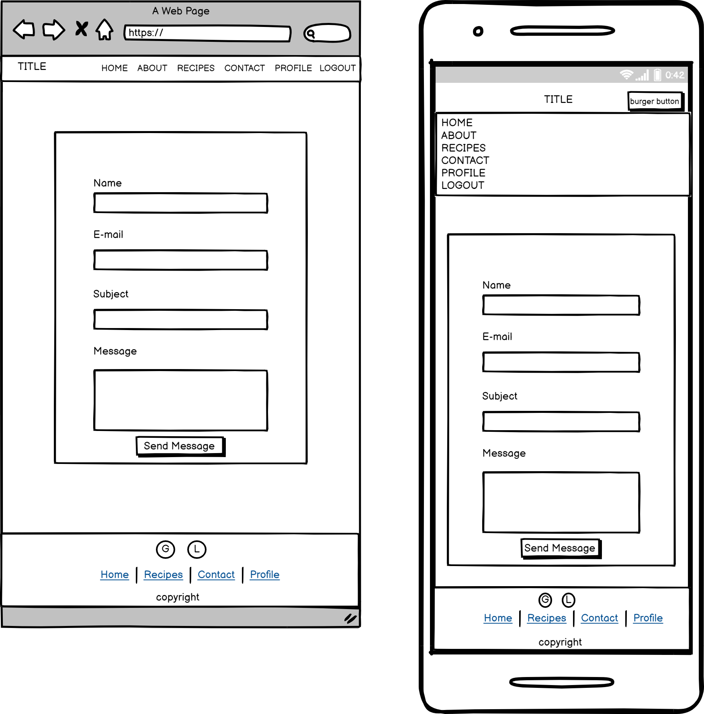

Logout Page 

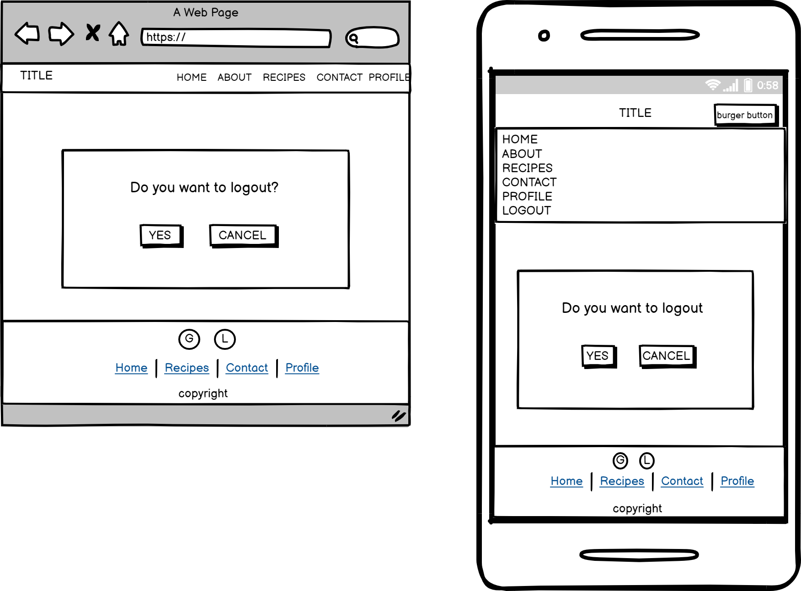

Sign-In Page 

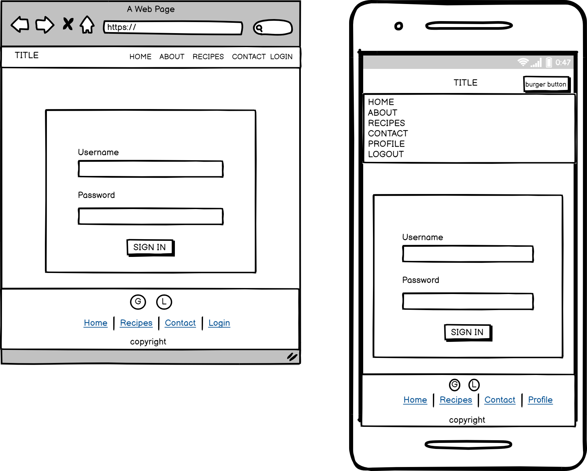

Sign up Page 

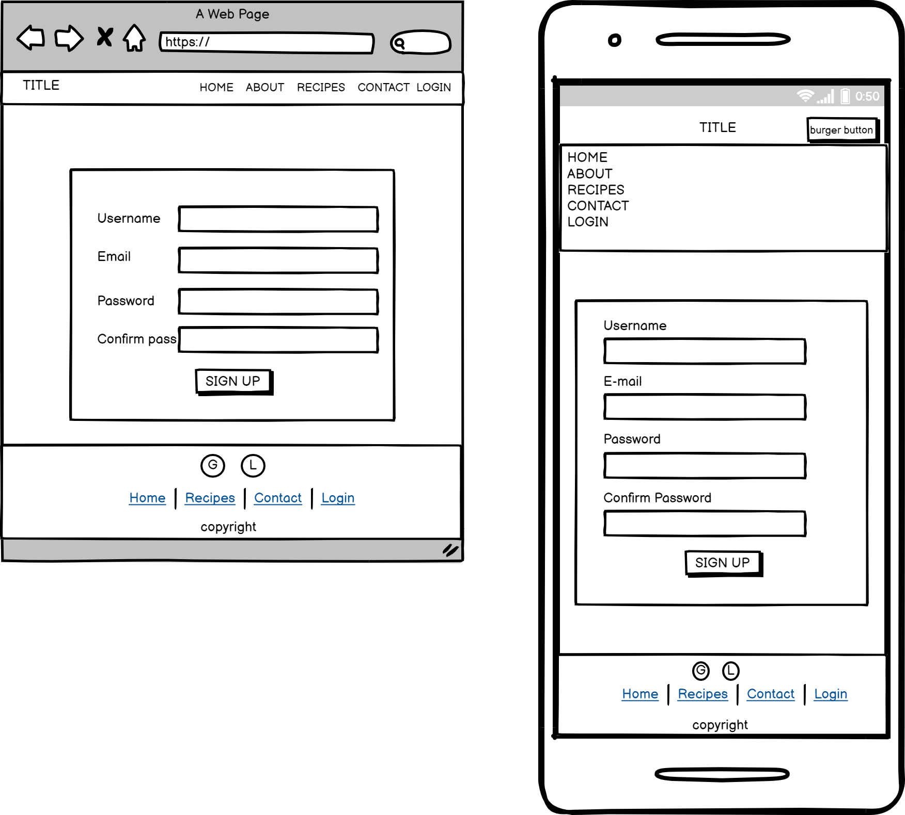

Profile Page 

Users will see the recpies they have uploaded, as well as any they have favourited.  
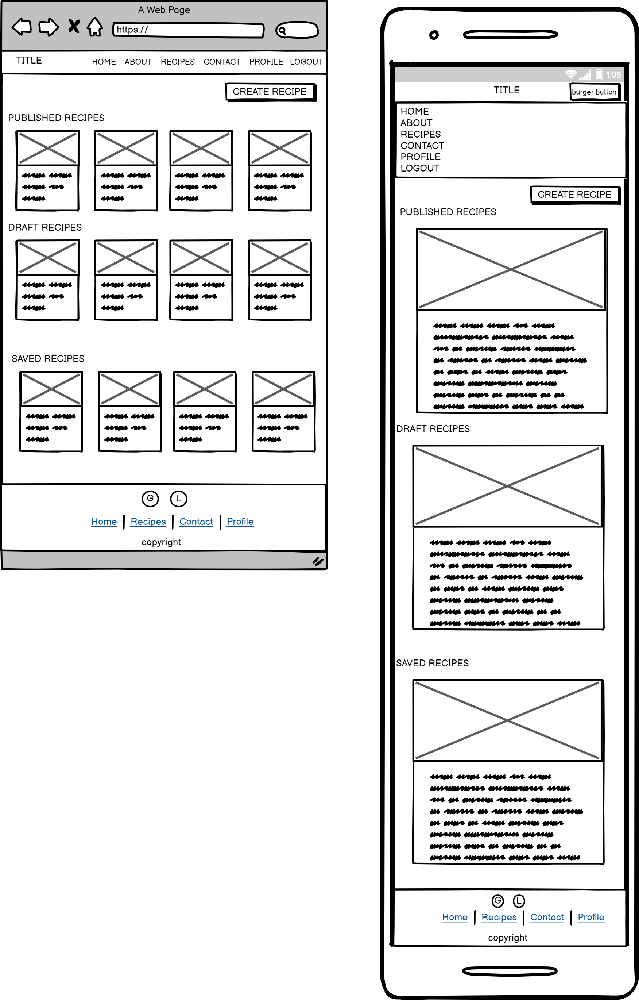

Recipe list

When logged in users will have the option to create a recipe. Logged out users can't see this button.  
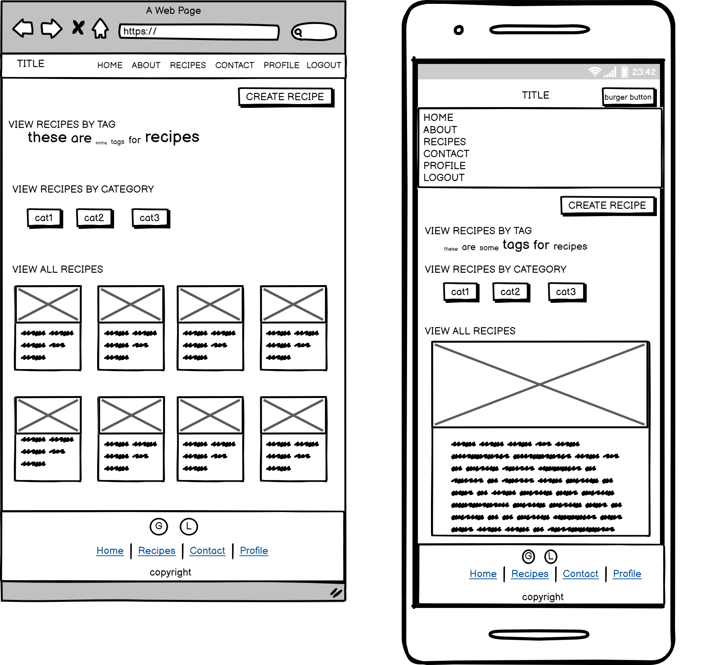

Recipe view

Logged in users will be able to see edit and delete buttons on this page if viewing their own recipes.  
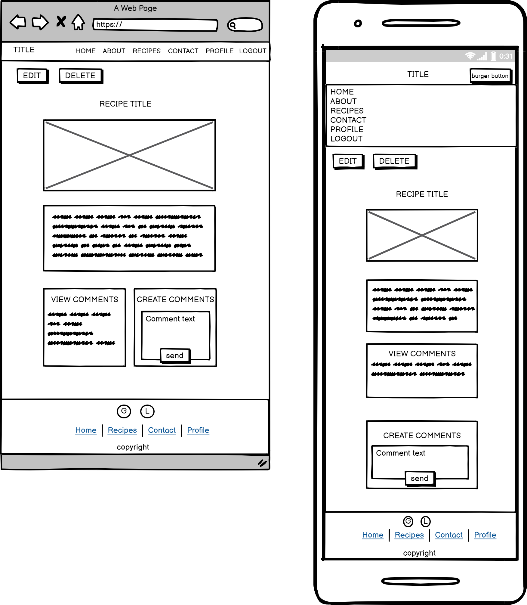

  
 

#### UI design

**Fonts**
* The main font used is x because x
* The main heading font is x because x
* The recipe create form has summernote fields which gives users the ability to quickly input their own fonts, styles etc. As this site aims to deliver a community feel I felt it best to enable users to be able to express some personality.

**Colour Scheme**

## Data Structure

The database used locally and by heroku is postgres.  
Cloudinary is used to house user images uploaded to the website.  

The database contains two custom models - recipes and comments. Both link to the user model which is built into django.
Each registered user is assigned a user id. They can create recipes which will be linked to their id, and each recipe has an auto generated slug field (this is derived from the recipe's title). The recipe can be edited and deleted by the person who created it only (or admin, if guidelines are breached). Registered users can leave comments on any recipe and the comment will display their username. A registered user can choose to publish recipes so they are displayed on the public recipe page, or leave them as drafts so they will only be visible on their own profile page. 

Custom data models used:

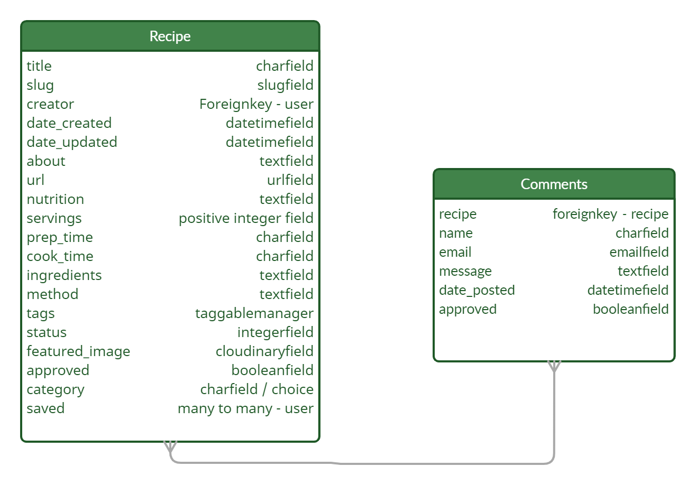

## Technologies Used

***

Languages
    - Python, javascript, html, css
Libraries etc
    - django, bootstrap, taggit, summernote, googlefonts, fontawesome, postgresql, cloudinary
Other tools
    - gitpod, git, github, heroku, w3c markup for html and css, jshint validator, linkchecker, lighthouse, pep8, grammerly, githubprojects, balsamiq,
    

## Features

- all pages
    - header
        - Website title which returns to home page if clicked
        - navbar with links for all users: home, recipes, about, contact 
        - navbar with links for logged out users: login, register 
        - navbar with links for logged in users: profile, logout
        - welcome message to logged in user
    - footer
        - social links (github and linkedin)
        - same links as navbar 
        
- home page
    - General intro to site so users know what the page is about upon landing
    - Explore box to encourage users to explore recipe page
    - Logged out users see a box which encourages them to sign up

- about page
    - a static page which tells users about the site, displays rules etc

- contact page
    - a form which visitors can use to contact site admin with queries, feedback etc.  
    Automated response to user is given with emailjs

- recipe page
    - List of recipes which have been published by users and approved by admin
    - Pagination of recipes so list isn't too long
    - Filter by category
    - Filter by tags
    - logged in users can create recipes
    - each recipe can be clicked to display the full version

- detailed recipe page
    - Full view of recipe
    - Option to save recipe
    - Comments can be viewed by all users, and left by registered users
    - If the user created the recipe they have the option to edit or delete the recipe

- profiles
    - Registered users have a profile which displayed the recipes they have created as drafts and published.
    - Also shows a list of recipes they have favourited

### Future features 

* Socials sign in
* Forgot password functionality

## Testing 

***

### Manual Testing

The manual testing file is [here](TESTING.md)

### Validation

html: [W3C markup validator](https://validator.w3.org/)   
Each page url was ran through the validator and any errors or warnings that appeared were corrected, and the url was ran through the validator again.  

This is the error and warning free validation seen for most pages

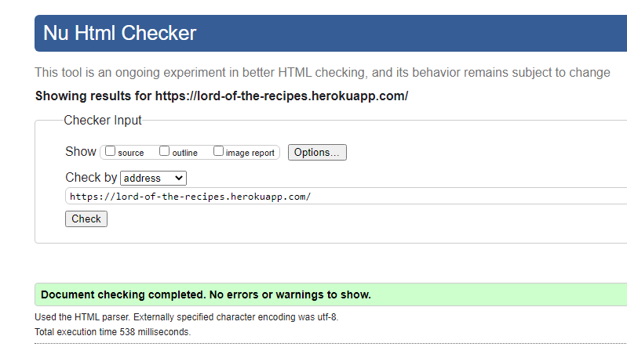

Extra closing p tag error

In some pages such as the profile page, recipe view page and recipe list page an error was showing that there was a closing p tag but no opening tag for it. In my hardcoded html there was no extra closing p tag. I believe this to have come from the use of summernote injecting it's own html. Feedback from previous projects were very specific about not leaving in **any** errors so I made the decision to follow the validator and remove the hardcoded closing p tag. This removes the error upon validation, and none arise for not having a closing tag hard coded.

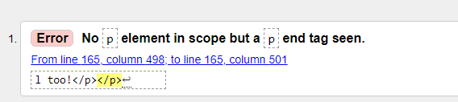

  
 

CSS: [W3C validator](https://jigsaw.w3.org/css-validator/)  
CSS file was copied into the validator and all errors and warnings returned were addressed.  

View clear validator

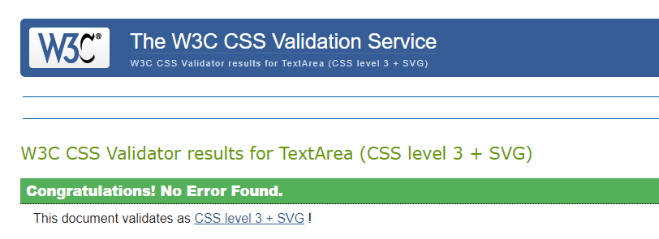

   

 

Python: [pep8](http://pep8online.com/)  
Code was copied directly into the validator.

Pep8 all clear message

Most python files were vallidated and corrected to have no errors or warnings. 
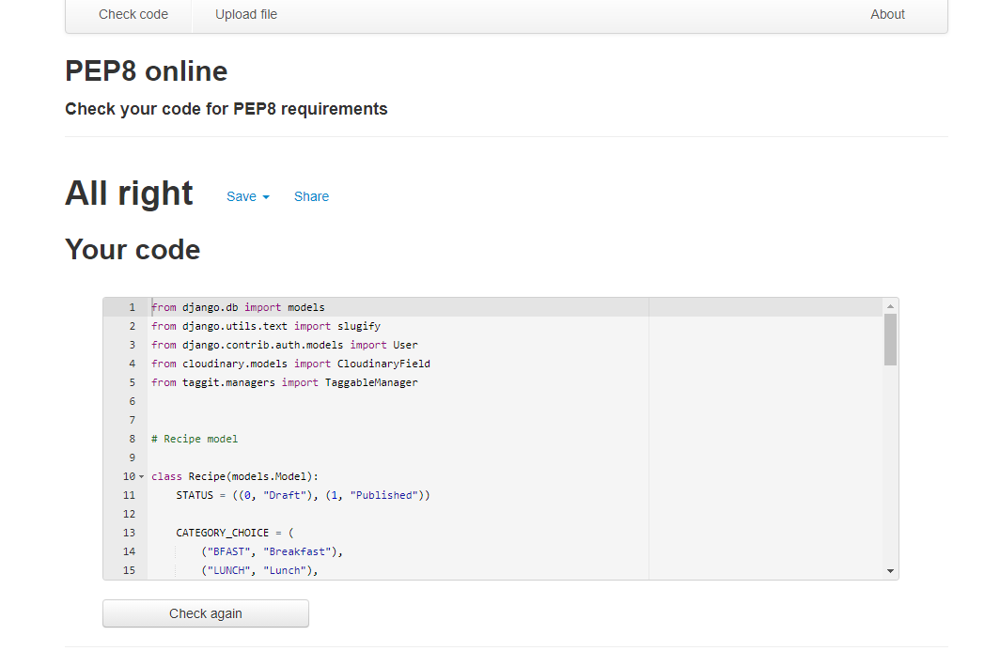

Some files had long lines which couldn't be broken

settings.py and views.py have lines which throw errors if broken using ' \ '.  
Instead #noqa was used to allow the validator to pass that line length error.  
While the limit should be kept below 79 characters, it is permissable to go up to 99 [[link](https://www.python.org/dev/peps/pep-0008/#:~:text=Some%20teams%20strongly%20prefer%20a%20longer%20line%20length.%20For%20code%20maintained%20exclusively%20or%20primarily%20by%20a%20team%20that%20can%20reach%20agreement%20on%20this%20issue%2C%20it%20is%20okay%20to%20increase%20the%20line%20length%20limit%20up%20to%2099%20characters%2C%20provided%20that%20comments%20and%20docstrings%20are%20still%20wrapped%20at%2072%20characters.)]
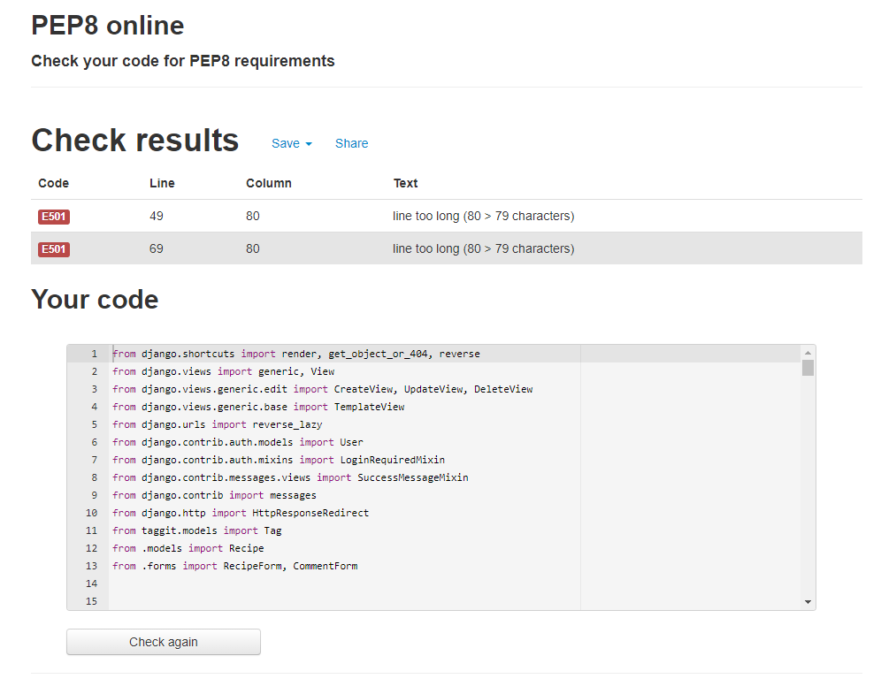

Code over 79 characters
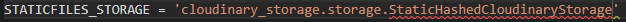

Example line of code

Error code e501

JS: [JSHint](https://jshint.com/)  
JS script was ran through jshint and returns no errors or warnings

View jshint result

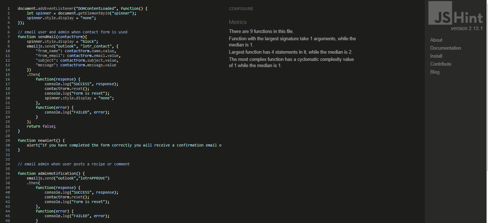

Links: [w3c link validator](https://validator.w3.org/checklink)
On the home page there was a warning for the LinkedIn link. It was tested manually as suggested and it works as expected.

View report here

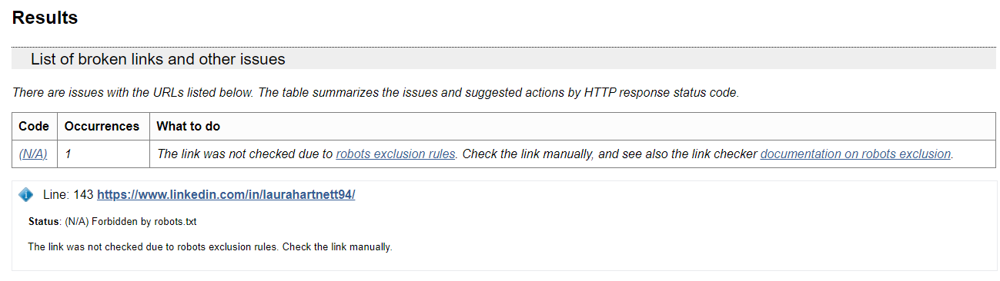

## Bugs

***

### Fixed 

* BUG: When registering for a profile, users who enter an email address get a 500 server request.
    * FIX: Turn off email verification
* BUG: When users first sign up they get a server 500 error when viewing profile
    * FIX: Placement of  was wrong
* BUG: Data in edit form shows html code
    * FIX: Add summernote widget to form fields
* BUG: Uploaded user photos don't show in full recipe view
    * FIX: Typo in html code
* BUG: Slug doesn't auto generate as in the admin panel
    * FIX: Add slugify to model for front end generation.  
    https://kodnito.com/posts/slugify-urls-django/
* BUG: Heroku error h10 
    * FIX: This appeared numerous times, and was usually a syntax / punctuation error in settings.py

### Remaining

### Terminal problems

## Credits

***

- Media
    

- Code

* Cancel function to load previous page  
https://stackoverflow.com/questions/524992/django-templates-create-a-back-link
    

## Deployment

***

This program is deployed using [Heroku](https://dashboard.heroku.com/login).  

Before deploying a project, ensure all dependencies (libraries etc that Heroku needs to build and run your project) are listed. The command "pip3 freeze > requirements.txt" in the python terminal will generate this list in a file called requirements.txt which will be read by Heroku.  
Ensure debug is set to false

### Set up the App

### Deployment

## Getting a copy of this project

### Forking Repository

To get a copy of this code you can manipulate without affecting the main code, it can be forked.

- Go to the repository page on GitHub. This project is 
- Find 'fork' along the top of the page
- A copy of this code will be sent to your own repository, where you can use that pretty green button to open it in GitPod

### Cloning Repository

If you need a local copy of the code to play with, cloning the code is a better option.

- Go to the repository page on GitHub. This project is 
- Find the button that says 'Code' beside the green Gitpod button. 
- Choose the cloning method you require (HTTPS/ SSH or CLI)
- Open Git Bash
- Enter the working directory as your desired location for the cloned directory
- Type "git clone" and paste the URL you copied from github
- Hit enter and the code should be cloned for local use

## Acknowledgements

